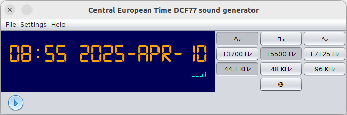
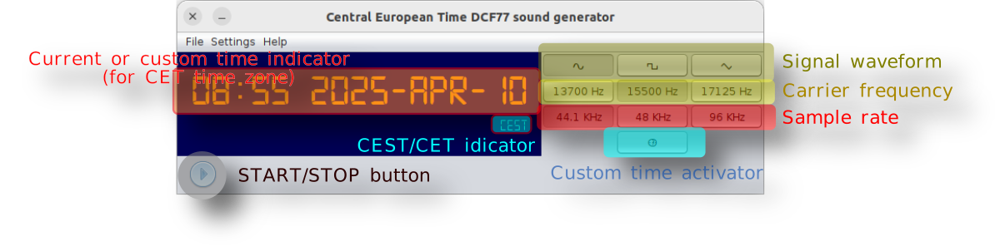

   
[](http://www.apache.org/licenses/LICENSE-2.0)
[](https://bell-sw.com/pages/downloads/#jdk-21-lts)   
[](https://www.arthursacresanimalsanctuary.org/donate)

# Central European Time DCF77 Soundwave Generator

## Pre-word

If you've ever owned a radio-controlled wrist watch, you probably know how convenient it is to have a device that always shows
the exact time without manual adjustment. These watches synchronize themselves with atomic time broadcasts, one of the
most well-known of which is [DCF77](https://en.wikipedia.org/wiki/DCF77), a longwave time signal transmitted from Germany on a frequency of 77.5 kHz.

Unfortunately, for those of us living in places like [Estonia](https://en.wikipedia.org/wiki/Estonia), the [DCF77](https://en.wikipedia.org/wiki/DCF77) signal tends to be very weak or unreliable due
to distance and geographical interference. That was exactly my experience after getting a radio-controlled clock. I
quickly realized that it wasn’t going to sync reliably with the official signal.

Since 1.1.0 version, the application supports listed time signal formats:

- __DCF77:__ German longwave time signal broadcast from Mainflingen, used mainly in Europe.
- __JJY:__ Japanese time signal transmitted from two locations, covering Japan and nearby regions.
- __WWVB:__ U.S. longwave time signal from Colorado, widely used in North America.
- __BPC:__ Chinese time signal transmitted from Shangqiu, covering China and surrounding areas.


I looked into existing mobile apps that claim to generate DCF77-compatible signals by simulating the time code
acoustically. While a few options were available, I found them limited in features or simply not very reliable in
practice. That’s when I decided to build my own solution.

This project is a Java-based desktop application that can generate a time signal similar to [DCF77](https://en.wikipedia.org/wiki/DCF77), intended to be
interpreted by radio-controlled clocks. Since 77.5 kHz is well beyond the capabilities of consumer-grade sound cards,
the application uses an alternative approach: it generates an audio signal at a multiple of the original frequency,
leveraging harmonics to simulate the real [DCF77](https://en.wikipedia.org/wiki/DCF77) broadcast. This way, the wrist watch's receiver may still lock on to the
signal if placed near the audio source (like headphones or a speaker).


The result is a handy desktop free utility that lets you synchronize your radio-controlled wrist watch without needing a
strong
over-the-air signal—particularly useful if you live in a region with poor [DCF77](https://en.wikipedia.org/wiki/DCF77) reception or want to test clock
synchronization indoors.

## Application



The application is written in [Java](https://en.wikipedia.org/wiki/Java_(programming_language)) and
requires [Java 11](https://bell-sw.com/pages/downloads/#jdk-21-lts) or later to be installed on your computer. For
convenience,
there are also build versions that come bundled with a compatible Java runtime, so you don't have to install Java
separately if you don’t want to.

| OS                                           | Download link                                                                                                                                               | 
|----------------------------------------------|-------------------------------------------------------------------------------------------------------------------------------------------------------------|
|         | __[Archive with JRE for Windows amd64](https://github.com/raydac/dcf77-soundwave/releases/download/1.1.1/dcf77-soundwave-app-1.1.1-windows-jdk-amd64.zip)__ |
|         | __[Archive without JRE for Windows](https://github.com/raydac/dcf77-soundwave/releases/download/1.1.1/dcf77-soundwave-app-1.1.1.exe)__                      |
|           | __[Archive with JRE for MacOS amd64](https://github.com/raydac/dcf77-soundwave/releases/download/1.1.1/dcf77-soundwave-app-1.1.1-macos-jdk-amd64.zip)__     |
|  | __[Archive with JRE for MacOS arm64](https://github.com/raydac/dcf77-soundwave/releases/download/1.1.1/dcf77-soundwave-app-1.1.1-macos-jdk-aarch64.zip)__   |
|           | __[DMG package for MacOS (no JRE)](https://github.com/raydac/dcf77-soundwave/releases/download/1.1.1/dcf77-soundwave-app_1.1.1.dmg)__                       |
|         | __[Archive with JRE for Linux amd64](https://github.com/raydac/dcf77-soundwave/releases/download/1.1.1/dcf77-soundwave-app-1.1.1-linux-jdk-amd64.tar.gz)__  |
|      | __[AppImage for Linux amd64](https://github.com/raydac/dcf77-soundwave/releases/download/1.1.1/dcf77-soundwave-app-1.1.1-x86_64.AppImage)__                 |
|           | __[Cross-platform JAR file](https://github.com/raydac/dcf77-soundwave/releases/download/1.1.1/dcf77-soundwave-app-1.1.1.jar)__                              | 

__[Full set of latest pre-built applications](https://github.com/raydac/dcf77-soundwave/releases/latest)__

If you are building it yourself from source, you will need to have [Apache Maven](https://maven.apache.org/)
and [JDK 11+](https://bell-sw.com/pages/downloads/#jdk-21-lts) installed. In this case, the command line to build the
distributions will be:

- just to build the project

  ```bash
    mvn clean install
  ```

- build with distributes

  ```bash
    mvn clean install -Ppublish,appimage
  ```

It runs as a standard desktop GUI application, offering a user-friendly interface where you can select key parameters
for signal generation. These include:

- __Signal waveform__ – This affects the harmonic profile and can influence how well your wrist watch picks up the generated
  signal. 
- __Carrier frequency__ – The base frequency used for the audio signal, ideally a multiple or harmonic of 77.5 kHz.
- __Sample rate__ – The audio output's sampling frequency, which impacts the fidelity and quality of the harmonics.



The application reads the current system time, so it’s important to make sure your computer’s clock is accurate. For
best results, synchronize your PC clock with an NTP server before starting.

To begin generating the signal, all you have to do is press the PLAY button. The application will then emit a modulated
audio signal based on the current time and selected settings. If you need to change the audio output device (e.g.,
switch from speakers to headphones), you can do that via the Settings menu.

In addition to real-time signal generation, the app also supports:

- Setting a custom time manually, which is useful for testing or calibration.
- Saving the generated signal as a WAV file of a specified duration, which can be played back later or used in other
  scenarios.
